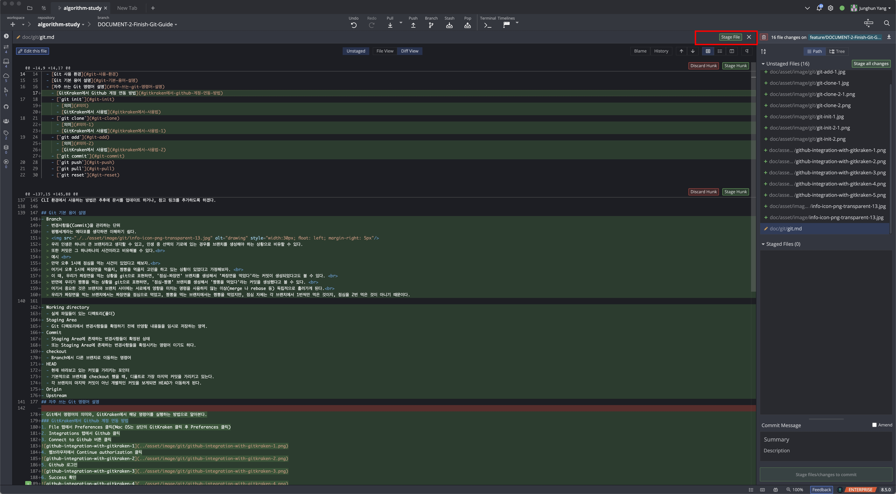

# Git 기초 및 활용법

- [Git 기초 및 활용법](#git-기초-및-활용법)
  - [Git](#git)
  - [버전 관리(형상 관리)](#버전-관리형상-관리)
  - [다시 Git으로](#다시-git으로)
  - [Git, Github의 관계](#git-github의-관계)
  - [Git 사용 환경](#git-사용-환경)
  - [Git 기본 용어 설명](#git-기본-용어-설명)
  - [자주 쓰는 Git 명령어 설명](#자주-쓰는-git-명령어-설명)
    - [GitKraken에서 Github 계정 연동 방법](#gitkraken에서-github-계정-연동-방법)
    - [`git init`](#git-init)
      - [의미](#의미)
      - [GitKraken에서 사용법](#gitkraken에서-사용법)
    - [`git clone`](#git-clone)
      - [의미](#의미-1)
      - [GitKraken에서 사용법](#gitkraken에서-사용법-1)
    - [`git add`](#git-add)
      - [의미](#의미-2)
      - [GitKraken에서 사용법](#gitkraken에서-사용법-2)
    - [`git commit`](#git-commit)
      - [의미](#의미-3)
      - [GitKraken에서 사용법](#gitkraken에서-사용법-3)
    - [`git push`](#git-push)
      - [의미](#의미-4)
      - [GitKraken에서 사용법](#gitkraken에서-사용법-4)
    - [`git pull`](#git-pull)
      - [의미](#의미-5)
      - [GitKraken에서 사용법](#gitkraken에서-사용법-5)
    - [`git reset`](#git-reset)
      - [의미](#의미-6)
      - [GitKraken에서 사용법](#gitkraken에서-사용법-6)
    - [`git revert`](#git-revert)
      - [의미](#의미-7)
      - [GitKraken에서 사용법](#gitkraken에서-사용법-7)
    - [`git stash`](#git-stash)
      - [의미](#의미-8)
      - [GitKraken에서 사용법](#gitkraken에서-사용법-8)
    - [`git pop`](#git-pop)
      - [의미](#의미-9)
      - [GitKraken에서 사용법](#gitkraken에서-사용법-9)
    - [`git branch`](#git-branch)
      - [의미](#의미-10)
      - [GitKraken에서 사용법](#gitkraken에서-사용법-10)
    - [`git checkout`](#git-checkout)
      - [의미](#의미-11)
      - [GitKraken에서 사용법](#gitkraken에서-사용법-11)
    - [`git merge`](#git-merge)
      - [의미](#의미-12)
      - [GitKraken에서 사용법](#gitkraken에서-사용법-12)
        - [목표 : main 브랜치에 있는 `Update README.md` 변경사항을 test 브랜치에 일괄적용(병합)하기](#목표--main-브랜치에-있는-update-readmemd-변경사항을-test-브랜치에-일괄적용병합하기)
    - [`git rebase`](#git-rebase)
  - [Pull Request(PR)](#pull-requestpr)
  - [참고자료](#참고자료)


## Git
Git은 분산 버전 관리 시스템이다.
버전 관리라는 것을 분산해서 하는 시스템이라는 것인데, 무슨 말인지 이해가 잘 되지 않는다.
이 정의를 이해하려면 먼저 버전 관리라는 용어의 의미를 이해해야 한다.
## 버전 관리(형상 관리)
우리가 코드를 작성하고 수정하고 배포를 하면서, 우리가 작성하는 애플리케이션은 계속 변화한다.
그리고 이러한 변화를 버전(Version)이라는 형태로 관리를 한다.
보통 숫자를 매기거나, 알파벳을 추가하기도 하며 작성한 코드의 변화를 기록한다.

즉, **버전 관리**(또는 **형상 관리** 라고도 한다.)라는 용어는 코드가 언제, 누구에 의해, 그리고 어떤 변화가 있었는지를 데이터로 저장하는 역할을 한다.

뿐만 아니라, 버전 관리에는 단순히 코드의 변화를 저장하는 역할 뿐만 아니라, 현재까지 작성된 코드가 문제가 있을 시에 다시 이전 버전으로 돌아갈 수도 있다(이를 롤백, Rollback 이라고 한다.)

이렇게 버전을 관리할 때 우리는 많은 이점을 얻게 된다.
(버전 관리를 사용하지 않을 때와 비교하였을 때의 이점)
1. 직접 변경 사항을 파일의 형태로 저장하고 보관하는 번거로움이 줄어든다.
2. 롤백이 빠르게 가능하기 때문에 배포한 코드에서 오류가 있을 경우 신속하게 대처가 가능하다.
3. 현재의 상태 또한 저장되어 있기 때문에, 테스트 버전이나 유사한 환경을 만드는 것도 용이하다.

## 다시 Git으로
그렇다면 이제 버전관리는 이해를 하였으니, 분산이라는 용어의 의미를 알 필요가 있다.
왜 버전 관리 시스템이라고 하지 않고 **분산** 이라는 용어를 붙인 것일까? 
굳이 분산이라는 용어를 붙였다는 것은 분산형이 아닌 버전 관리 시스템도 있는 것인가라는 의문이 들 수 있다.

그렇다. 버전 관리 시스템도 여러 종류가 있다.
그리고 Git과 가장 대비되는 버전 관리 시스템은 **SVN**이 있다.
SVN은 Git과 다르게 중앙 저장소(Repository 라고 함)를 중심으로 코드를 관리한다.
반면에 Git은 저장소를 관리하는 개발자들 각각의 컴퓨터에 **분산되어** 저장한다는 차이점이 있다. 
## Git, Github의 관계
그럼 이제 Git과 Github 이 두가지의 차이를 알아보자.

이 개념을 설명하기 위해서는 Local Repository, 그리고 Remote Repository를 알아야 한다.

앞서 보았듯이, Git은 분산 버전 관리 시스템이기 때문에, 한 레포지토리의 코드가 여러 컴퓨터에 분산되어 저장된다.

예시를 들자면, 개발자 A,B,C가 blog 라는 레포지토리를 관리한다면, blog라는 레포지토리는 A,B,C의 컴퓨터에 각각 저장되어 있을 것이다.

그리고 이때, A와 B와 C가 작성하는 코드가 겹치지 않아서 서로 다른 버전을 가지게 되는 상황이라고 가정을 해보자. 
결국 우리는 A와 B와 C가 개발한 기능들이 모두 반영이 되어야 한다.
이 때 어떤 개발자의 저장소가 중심가 되어야 할까?


예를 들어 B의 저장소가 중심이 되고(항상 최신 기능들을 가지고 있고) 나머지가 B의 저장소를 기준으로 삼는다고 해도 이는 좋은 방법이 아니다.

왜냐하면 B도 자신의 맡은 부분을 개발해야 하고, B의 저장소 코드 역시 수시로 변할 것이기 때문에, A와 C는 계속 B의 코드를 동기화 해야 하며, B가 개발하는 상황에 A와 C의 코드가 영향을 받는다.
그리고 만약 B의 코드에 버그나 에러가 있을 경우, A와 C의 코드도 같이 문제가 생기는 현상이 생기는 것이다.

그럼 이 문제를 어떻게 해결할까?
해결 하는 방법은 다음과 같다.

**A도 B도 C도 아닌 다른 곳에 기준점이 있으면 된다.**

다른 어떤 곳, 프로젝트 팀원들이 접근이 용이한 인터넷 상에 저장소가 있다면, 관리가 쉬워진다.
모든 개발자는 인터넷 상의 저장소를 바라보면 되고, 다른 사람들의 코드 변경을 신경쓰지 않아도 된다.


Git은 이 문제를 해결하기 위해 Local 저장소(각자의 컴퓨터에 저장된 저장소)와 Remote 레포지토리(인터넷 상에 올라가 있는 저장소)를 두었다.

프로젝트에서 개발을 담당하는 모든 개발자는 Remote를 기점으로 자신의 코드를 작성하면 되며, 내 코드를 Remote에 반영하면 되는 것이다.
그래서 실제 Git을 사용할 때는 Remote에 올라와있는 버전을 내 컴퓨터로 가져와서 작업을 하고, 이를 인터넷 상에 변경사항을 업로드 하는 식으로 진행 된다.

> 사실 Upstream 을 사용하는 방법도 있으나 이는 뒤에서 설명하겠다.
> 
> Remote를 사용하는지, Upstream을 사용하는지는 속한 조직의 룰에 따라 다르다.
> Upstream을 사용하는 경우는 주로 오픈소스에 내 변경사항을 건의하여 반영하고 싶을 때 사용하는 방식이다.


저장소를 인터넷 상에 저장하기 위해서는 인터넷에서 저장소를 만들 수 있도록 제공이 되어야 한다.
그리고 이 저장소를 제공하는 대표적인 사이트가 바로 `Github` 이다.
리모트 레포지토리를 생성할 수 있는 곳은 `Github` 뿐만 아니라 여러 곳이 있으며, 대표적인 사이트 들은 아래의 사이트들이 있다.
- Gitlab
- BitBucket

## Git 사용 환경
모든 개발환경이 그렇듯이, Git도 두 가지 사용 환경을 제공한다.
1. CLI(Command Line Interface)
2. GUI(Graphic User Interface)

CLI의 경우 흔히 터미널이라 불리는 검은 창에 
```bash
git add .
git commit -m "Init Commit"
git push
```
등의 형태로 사용하는 방식이다.
CLI 환경은 리눅스 기반이라면 OS 설치시에 이미 내장 되어 있으며, 윈도우의 경우 git을 설치하면 git bash에서 사용 가능하다.

반면에 GUI는 우리가 일반적으로 사용하는 인터페이스이다.
GUI로 git을 제공하는 많은 프로그램들이 있는데, 일부를 소개하겠다.

- GitKraken
- Github Desktop
- Sourcetree
- 등등

여기서는 GitKraken을 기준으로 Git 명령 사용법을 이해해본다.

GitKraken을 사용하는 이유는 GUI 환경에서 Git을 가장 잘 활용할 수 있도록 도와주기 때문이며,
다음 문서에서 다룰 git-flow나 사용하기 어려운 git 명령어도 직관적으로 이해하기 쉬운 인터페이스를 제공한다.
CLI 환경에서 사용하는 방법은 추후에 문서를 업데이트 하거나, 참고 링크를 추가하도록 하겠다.

## Git 기본 용어 설명
- Branch
  - 변경사항들(Commit)을 관리하는 단위
  - 평행세계라는 메타포를 생각하면 이해하기 쉽다.
  > 
  > 우리 인생은 하나의 큰 브랜치라고 생각할 수 있고, 인생 중 선택의 기로에 있는 경우를 브랜치를 생성해야 하는 상황으로 비유할 수 있다.
  > 또한 커밋은 그 하나하나의 사건이라고 비유해볼 수 있다.<br>
  > 예시 <br>
  > 만약 오후 1시에 점심을 먹는 사건이 있었다고 해보자.<br>
  > 여기서 오후 1시에 짜장면을 먹을지, 짬뽕을 먹을지 고민을 하고 있는 상황이 있었다고 가정해보자. <br>
  > 이 때, 우리가 짜장면을 먹는 상황을 git으로 표현하면, '점심-짜장면' 브랜치를 생성해서 '짜장면을 먹었다'라는 커밋이 생성되었다고도 볼 수 있다. <br>
  > 반면에 우리가 짬뽕을 먹는 상황을 git으로 표현하면, '점심-짬뽕' 브랜치를 생성해서 '짬뽕을 먹었다'라는 커밋을 생성했다고 볼 수 있다. <br>
  > 여기서 중요한 것은 브랜치와 브랜치 사이에는 서로에게 영향을 미치는 명령을 사용하지 않는 이상(merge 나 rebase 등) 독립적으로 흘러가게 된다.<br>
  > 우리가 짜장면을 먹는 브랜치에서는 짜장면을 점심으로 먹었고, 짬뽕을 먹는 브랜치에서는 짬뽕을 먹었지만, 점심 자체는 각 브랜치에서 1번씩만 먹은 것이지, 점심을 2번 먹은 것이 아니기 때문이다.

- Working directory
  - 실제 파일들이 있는 디렉토리(폴더)
- Staging Area
  - Git 디렉토리에서 변경사항들을 확정하기 전에 반영할 내용들을 임시로 저장하는 영역.
- Commit
  - Staging Area에 존재하는 변경사항들이 확정된 상태
  - 또는 Staging Area에 존재하는 변경사항들을 확정시키는 명령어 이기도 하다.
- checkout
  - Branch에서 다른 브랜치로 이동하는 명령어
- HEAD
  - 현재 바라보고 있는 커밋을 가리키는 포인터
  - 기본적으로 브랜치를 checkout 했을 때, 디폴트로 가장 마지막 커밋을 가리키고 있는다.
  - 각 브랜치의 마지막 커밋이 아닌 개별적인 커밋을 보게되면 HEAD가 이동하게 된다.
- Origin
- Upstream
## 자주 쓰는 Git 명령어 설명
- Git에서 명령어의 의미와, GitKraken에서 해당 명령어를 실행하는 방법으로 알아본다.
### GitKraken에서 Github 계정 연동 방법
1. File 탭에서 Preferences 클릭(Mac OS는 상단의 GitKraken 클릭 후 Preferences 클릭)
2. Integrations 탭에서 Github 클릭
3. Connect to Github 버튼 클릭

4. 웹브라우저에서 Continue authorization 클릭

5. Github 로그인

6. Success 확인

6. 연동 성공 확인

### `git init`
#### 의미
- 현재 있는 폴더를 git 저장소로(local) 사용하도록 하는 명령어
#### GitKraken에서 사용법
1. Start a local repo 클릭

1. Local Only로 만드는 경우

   1. Name 입력
   2. 만들고자하는 디렉토리 설정(Initialize in)
   3. Create Repository 클릭
2. Github에 Remote를 생성하면서 만드는 경우

   1. Github.com 클릭
   2. 추가하고자 하는 Account 선택
   3. Github 레포지토리 Description에 추가할 내용 작성
   4. Access 유형 (Public/Private, Private은 Pro 버전 필요) 선택
   5. 컴퓨터에 레포지토리가 clone 될 경로 선택
   6. Create Repository and Clone 클릭
### `git clone`
#### 의미
- Remote Repository를 컴퓨터로 복사 해오는 명령어
#### GitKraken에서 사용법
1. Clone a repo 클릭

2. Clone 하기
   1. GitHub.com 클릭
   
      1. 내 계정의 Repo에서 clone할 레포 선택 후 Clone the repo! 클릭
   2. Clone with URL 선택
   
      1. clone할 레포의 URL을 입력하고 Clone the repo! 클릭
### `git add`
#### 의미
- commit을 찍기 전에(변경 사항들을 확정 짓기 전에), commit에 반영할 내용들을 Staging area에 추가하는 명령어
#### GitKraken에서 사용법
1. 기본적으로 변경사항이 있는 파일들을 tracking해서 Unstaged Files에서 확인 가능

2. 개별 파일을 Unstaged Files에서 선택해서 Stage File 클릭시 파일 전체의 변경 사항이 추가됨.
   1. 개별 파일에서 일부분만 add 하고 싶을 경우 Stage Hunk를 클릭하면 됨.  
  
   1. Staged Files 에서 해당 파일이 add 되어 있는 것을 확인 가능.
  
3. 변경 된 모든 파일들을 add 하고 싶을 경우 Stage all changes 버튼 클릭
  
  1. 모든 변경사항 들이 add 되어 있는 것을 확인 가능. 
  
### `git commit`
#### 의미
- 변경 사항들을 commit이라는 단위로 관리 하도록 확정 짓는 명령어
#### GitKraken에서 사용법
1. Commit Message 칸의 Summary(필수), Description(선택) 작성하기

2. 작성 후 하단의 Commit Changes to n files 클릭

3. Commit이 생성된 것을 확인 가능

### `git push`
#### 의미
- 로컬 레포지토리의 commit을 리모트 레포지토리(Github)에 반영하는 명령어
- push 와 pull을 비교해서 알아두자.
- 내 컴퓨터의 변경사항을 리모트로 밀어올려서 push.
#### GitKraken에서 사용법
1. 상단의 push 버튼 클릭

2. 리모트에 해당 브랜치가 없는 경우 위와 같이 리모트에 브랜치 생성도 동시에 진행하게 된다.

3. push 완료 시, Origin 모양이 추가되었음을 확인 가능하다.(Github에 해당 브랜치가 push 되었음을 확인)

### `git pull`
#### 의미
- 리모트 레포지토리의 변경사항들을 로컬 레포지토리에 반영하는 명령어 
- 리모트의 변경사항을 내 컴퓨터로 땡겨오기 때문에 pull.
#### GitKraken에서 사용법
1. 리모트 레포지토리와 로컬 레포지토리 사이에 커밋이 차이나는 경우
2. 상단의 pull 버튼을 누른다.

3. 리모트 레포지토리와 로컬 레포지토리가 같은 커밋을 참조하는지 확인한다.

### `git reset`
#### 의미
- 반영했던 커밋들을 **없애고** 이전의 커밋으로 돌아가는 명령어
- reset 명령어는 soft, mixed, hard 순으로 정도가 있음
- soft는 돌아갈 커밋까지의 변경사항들이 전부 staged된 상태로 돌아감.
- mixed는 돌아갈 커밋까지의 변경사항들이 전부 unstaged된 상태로 돌아감.
- hard는 돌아갈 커밋까지의 변경사항들을 전부 지워버림.
- Revert와 비슷하지만 커밋 자체를 없애버리는 식으로 진행되는 것이기 때문에 다른 사람과 협업 시에 유의해야함.
#### GitKraken에서 사용법
1. reset 공통
   1. 돌아가고자 하는 커밋을 오른쪽 버튼으로 클릭
  
   2. Reset (branch Name) to this commit 클릭
  
   3. 원하는 reset 정도를 선택
  
2. soft
   1. 돌아가고자 하는 커밋 이후의 변경사항들이 Staged Files에 있는 것을 확인 가능.
     
3. mixed
   1. 돌아가고자 하는 커밋 이후의 변경사항들이 Unstaged Files에 있는 것을 확인 가능.
     
4. hard
   1. 돌아가고자 하는 커밋 이후의 변경사항들이 없어진 것을 확인 가능.
     
### `git revert`
#### 의미
- 반영했던 커밋을 취소하는 커밋을 생성해서 변경사항을 취소하는 명령어
- Reset은 실제로 커밋을 삭제하지만 Revert는 취소 커밋을 생성하는 방식(무르기와 비슷함)
- 여러명이 **같은 브랜치**에서 작업을 하고 있는 경우라면 Revert를 사용하는 것을 권장.
#### GitKraken에서 사용법
1. Revert하고자 하는 커밋에 오른쪽 버튼 클릭
2. Revert commit을 클릭

3. 위의 dialog에서 yes를 클릭

4. 선택한 커밋의 변경사항들을 취소하는 커밋이 생성되는 것을 확인

### `git stash`
#### 의미
- 기존의 staged 또는 unstaged 되어 있는 코드들을 stash(사물함)에 임시로 보관하는 명령어
- 브랜치를 변경하는 경우에 반영되지 않은 변경사항이 없으면 브랜치 변경이 되지 않는 상황에 주로 사용
- pop 명령어와 세트로 많이 씀
#### GitKraken에서 사용법
1. 작업중인 변경사항들이 있을 때, 위에 있는 Stash 버튼을 클릭한다.

2. Stash에 변경사항들이 보관되고, Staged나 Unstaged 되어있는 변경사항이 없는 것을 확인한다.

### `git pop`
#### 의미
- stash(사물함)에 임시로 보관되어 있는 변경사항을 다시 불러오는 명령어
#### GitKraken에서 사용법
1. Stash를 우클릭한다. (또는 stash가 하나밖에 없을 때는 위의 pop 버튼을 눌러도 된다)

2. Stash에 있던 변경사항들이 Unstaged Files와 Staged Files에 반영되는 것을 확인한다.

### `git branch`
#### 의미
- 브랜치 목록을 확인하는 명령어
- CLI에서는 git branch -c 브랜치이름 명령으로 브랜치 생성도 가능하다.
#### GitKraken에서 사용법
1. 브랜치를 생성하고 싶은 커밋을 우클릭한다.
   1. 만약 현재 바라보고 있는 커밋이 현재 브랜치에서 최신이라서 상단의 Branch 버튼을 눌러도 된다.
   2. Create Branch 메뉴를 클릭한다.
   
2. 브랜치 이름을 입력하고 생성한다. (feature/DOCUMENT-2/test 처럼 '/'를 주면 브랜치 폴더로 인식한다.) 
  
3. 브랜치가 정상적으로 생성되는지를 확인한다.
  
### `git checkout`
#### 의미
- 현재 작업하고 있는 브랜치를 옮길 때 사용하는 명령어
#### GitKraken에서 사용법
1. 옮기고 싶은 브랜치 이름을 더블 클릭한다.
  
2. 브랜치가 변경된 것을 확인한다.
  
### `git merge`
#### 의미
- A 브랜치와 A 브랜치에서 특정 커밋에서 생성되었던 B 브랜치가 있을 때, B 브랜치에서 작업한 커밋들을 A 브랜치에 일괄적용하는 명령어.
> 사용하게 되는 상황 <br>
> 보통 Git으로 협업을 하게 될 때는 실제로 배포가 되는(작업한 코드를 사용자가 사용하게 하는 행위) 코드를 직접 건드리지 않는다.(주로 master/main 브랜치)
> 대신 main 브랜치에서 develop 브랜치를 생성하고, develop 브랜치에서 feature 브랜치들을 생성해서 변경사항들을 반영하는 식으로 협업한다.
> 그리고 이러한 Git 관리방법을 Git-Flow라고 하며, 추후에 추가로 작성할 예정이다.
> 따라서 Git-Flow를 따를 시에, feature 브랜치에서 변경사항들을 작업을 하고, 이를 develop 브랜치로 변경사항들을 병합(merge) 하는 방법으로 작업을 한다.
> 즉, 이렇게 작업하는 이유는 기존의 잘 돌아가고 있는 코드를 변경하지 않고, 새로운 기능을 추가하거나 개선을 하기 위해서 이와 같은 방법을 사용한다.

#### GitKraken에서 사용법
##### 목표 : main 브랜치에 있는 `Update README.md` 변경사항을 test 브랜치에 일괄적용(병합)하기
1. 지금 main 브랜치와 test 브랜치가 서로 다른 갈래로 뻗어나가고 있는 것을 확인할 수 있다.
2. 자세히 보면 Merge branch 'release/v1.1.0' into main에서 부터 갈래가 달라진 것을 확인할 수 있다.
3. 이는 main 브랜치는 `Update README.md` 커밋이 생성되었고, test 브랜치는 `DOCUMENT-2 Git 기초 활용법 문서 작성` 이라는 커밋이 생성되면서 서로 다른 갈래가 생기게 된 것이다.

4. 그래서 main 브랜치의 README.md 커밋내용은 다음과 같다.

5. 우리는 README.md 변경사항이 test에도 적용이 되기를 바라기 때문에 merge를 수행할 것이다.
6. merge를 할때는 방향이 중요하다. 우리는 **main**의 변경사항이 **test** 에 적용되기를 원하므로, **main 브랜치를 끌어다가 test 브랜치에 놓는다**
 
7. 그러면 다음과 같은 메뉴가 나타나고 Merge main into test를 선택한다.(반대로 하면 **test**의 변경사항들 중 **main**에 반영되지 않은 내용들이 반영된다.)

8. merge가 완료되었음을 커밋이 생성된 것으로 확인한다.

9. main 브랜치를 merge의 커밋의 내용은 *test* 브랜치에 없던 `Update README.md` 커밋의 내용과 일치하는 것을 볼 수 있다.

### `git rebase`

## Pull Request(PR)

## 참고자료
- [Git 간편 안내서](https://rogerdudler.github.io/git-guide/index.ko.html)
- [nomadcoder 강의](https://nomadcoders.co/git-for-beginners)
- [생활코딩 Git 강의](https://opentutorials.org/module/3733)
- [Git vs SVN](https://velog.io/@lzhxxn/Git-이란)
- [Git의 기본 개념들 (1)](https://velog.io/@janeljs/git-4)
- [Git HEAD란 무엇인가?](https://kotlinworld.com/272)
- [Git에 대한 내용 정리](https://dimdim.tistory.com/entry/GIT%EC%97%90-%EB%8C%80%ED%95%9C-%EB%82%B4%EC%9A%A9%EC%A0%95%EB%A6%AC-%EC%A0%95%EB%A6%AC%EC%A4%91)
